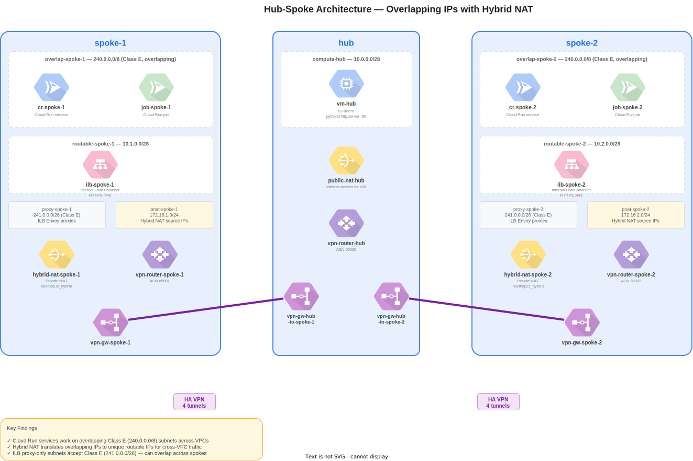
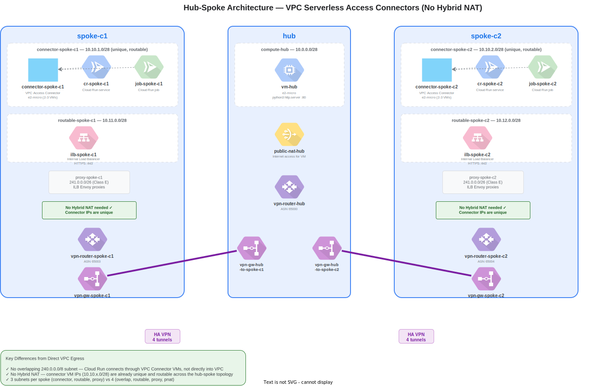

# Cloud Run Overlapping IPs with Hub-Spoke NAT

## What This Tests

Google Cloud allows non-routable IP ranges (Class E: `240.0.0.0/4`) in VPC subnets. This PoC demonstrates two approaches for enabling Cloud Run services to communicate bidirectionally with a central hub, even when spoke VPCs would otherwise have overlapping IP ranges.

### Approach 1: Direct VPC Egress

Cloud Run deploys directly into a VPC subnet with overlapping Class E IPs. Hybrid NAT translates overlapping source IPs into unique routable IPs before crossing HA VPN tunnels.

### Approach 2: VPC Serverless Access Connector

Cloud Run connects through VPC Connector VMs that have unique, routable IPs. No overlapping subnets or Hybrid NAT needed — the connector itself acts as the NAT boundary.

See [docs/comparison.md](docs/comparison.md) for a detailed side-by-side comparison.

## Architecture

### Direct VPC Egress




See [direct-vpc-egress/docs/architecture.md](direct-vpc-egress/docs/architecture.md) for full details.

### VPC Connector




See [vpc-connector/docs/architecture.md](vpc-connector/docs/architecture.md) for full details.

## Quick Start

```bash
# 1. Create service account and bind IAM roles (run as Owner/IAM Admin)
./setup-iam.sh

# 2. Impersonate the service account
gcloud config set auth/impersonate_service_account cloud-run-nat-poc@PROJECT_ID.iam.gserviceaccount.com
```

Then choose an approach:

### Direct VPC Egress
```bash
cd direct-vpc-egress

./setup-infra.sh           # Hub + spoke VPCs, subnets, VM, Cloud Run (Direct VPC Egress)
./setup-connectivity.sh    # HA VPN, BGP, Hybrid NAT, Public NAT, ILB
# Wait ~60s for BGP convergence
./test.sh                  # Test both traffic flows
./teardown.sh              # Tear down when done (~$0.60/hr while running)
```

### VPC Connector
```bash
cd vpc-connector

./setup-infra.sh           # Hub + spoke VPCs, subnets, VM, VPC Connectors, Cloud Run
./setup-connectivity.sh    # HA VPN, BGP, Public NAT, ILB (NO Hybrid NAT)
# Wait ~60s for BGP convergence
./test.sh                  # Test both traffic flows
./teardown.sh              # Tear down when done (~$0.60/hr while running)
```

## Repository Structure

```
├── setup-iam.sh                    # Shared IAM setup (service account, roles, APIs)
├── shared/
│   ├── setup-hub.sh                # Shared hub: Artifact Registry, containers, VPC, VM
│   └── teardown-hub.sh             # Shared hub teardown (checks for remaining spokes)
├── direct-vpc-egress/
│   ├── setup-infra.sh              # Spoke infra (overlapping subnets, Hybrid NAT)
│   ├── setup-connectivity.sh       # VPN + BGP + Hybrid NAT + ILB
│   ├── teardown.sh                 # Full teardown
│   ├── test.sh                     # Traffic flow tests
│   └── docs/                       # Architecture docs + diagrams
├── vpc-connector/
│   ├── setup-infra.sh              # Spoke infra (VPC Connectors, no overlapping IPs)
│   ├── setup-connectivity.sh       # VPN + BGP + ILB (NO Hybrid NAT)
│   ├── teardown.sh                 # Full teardown
│   ├── test.sh                     # Traffic flow tests
│   └── docs/                       # Architecture docs
├── container/                      # Cloud Run service (Go HTTP server)
├── container-job/                  # Cloud Run job (Go HTTP client)
└── docs/
    └── comparison.md               # Side-by-side comparison of approaches
```

All scripts default `PROJECT_ID` to `sb-paul-g-vpcsac`. Region is `europe-north2`. All scripts are idempotent.

## Resources Created

### Direct VPC Egress
- **3 VPCs** — `hub`, `spoke-1`, `spoke-2`
- **10 subnets** — compute, overlap (x2), routable (x2), proxy-only (x2), private NAT (x2)
- **1 VM** — `vm-hub` (e2-micro, python3 HTTP server)
- **2 Cloud Run services + 2 jobs** — Direct VPC Egress on overlapping `240.0.0.0/20`
- **8 HA VPN tunnels**, **6 Cloud Routers**, **2 Hybrid NATs**, **1 Public NAT**, **2 ILBs**

### VPC Connector
- **3 VPCs** — `hub`, `spoke-c1`, `spoke-c2`
- **7 subnets** — compute, connector (x2), routable (x2), proxy-only (x2)
- **1 VM** — `vm-hub` (shared with Direct VPC Egress)
- **2 VPC Access Connectors** — e2-micro, unique routable IPs
- **2 Cloud Run services + 2 jobs** — via VPC Connector
- **8 HA VPN tunnels**, **4 Cloud Routers**, **1 Public NAT**, **2 ILBs**

## Cost

~$0.60/hr when running (VPN tunnels dominate). Tear down after each test session.
